# **Project: Dynamic Scaling in AWS Auto Scaling.**

## _Project Goals:_

1. Understand the given Architecture Diagram
2. Create the infrastructure
3. Ensure your infrastructure is splitted across multiple zone in a silgle region
4. Deploy a simple Node.js application to the infrastructure
5. Load test the application
6. Ensure the Auto-scaling group increase the instance when the CPU usage rises to 80%
7. Ensure the Auto-scaling group increase the instance when the Memory usage rises to 80%
8. Ensure the Auto-scaling group scales down when the load decreases
9. Ensure you DELETE all you resources after you are done.

# **Architecture Diagram**

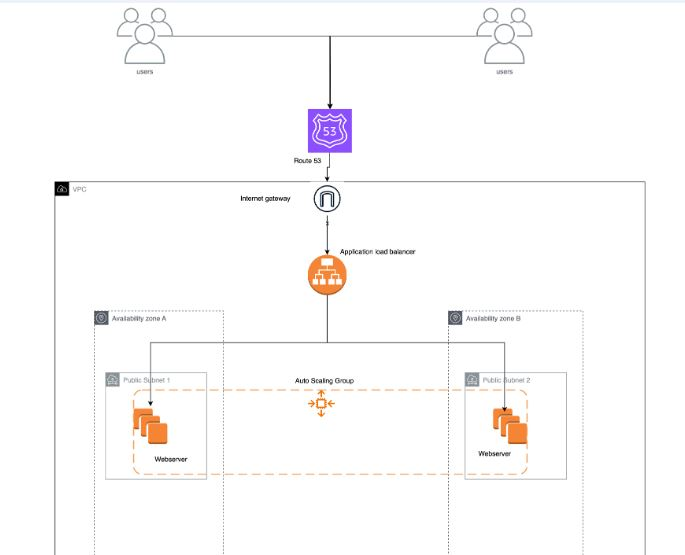

# _Step-by-Step Implementation:_

## Step 1: Understand the Architecture Diagram

### _The architecture should include:_

- An Application Load Balancer (ALB) to distribute traffic.
- Auto Scaling Groups (ASGs) to manage EC2 instances.
- EC2 instances running the Node.js application.
- CloudWatch for monitoring CPU and memory usage.
- Multiple Availability Zones (AZs) for high availability.

## Step 2:Create the Infrastructure

### 2.1 Set Up the VPC and Subnets

- Create a VPC and multiple subnets in different availability zones within the same region.

  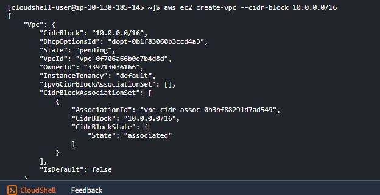

- Create an Internet Gateway, Attach it to your VPC.

  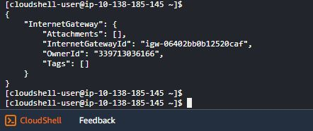

- Create Route Tables and associate it with the public subnets.

  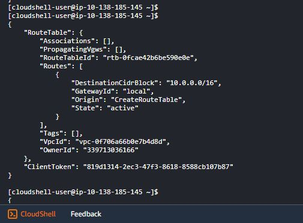

  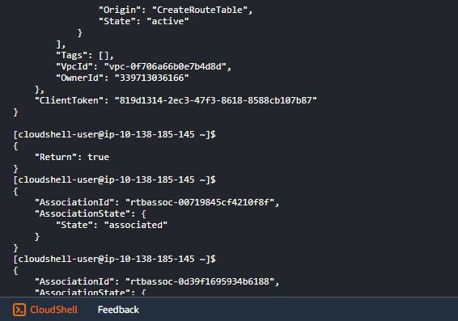

- Add a route to the internet gateway.

  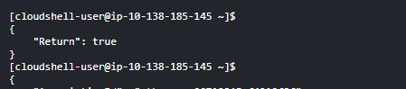

### 2.2 Create Security Groups

- Create a security group to allow HTTP (port 80) and SSH (port 22) access.

  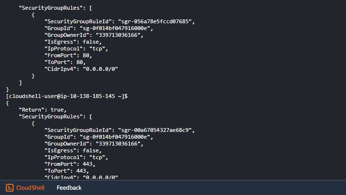

- Create a Security Group for EC2 Instances,allow inbound traffic from the load balancer security group, allow outbound traffic to the internet.

  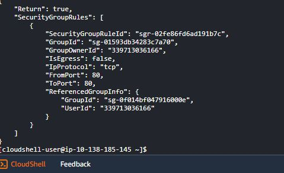

  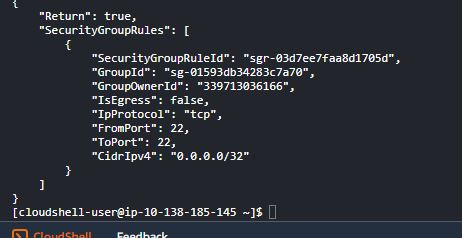

### 2.3 Set Up the ALB

Create an Application Load Balancer.

1. Create a Load Balancer:

- Go to the EC2 Dashboard and select "Load Balancers".
- Click on "Create Load Balancer" and choose "Application Load Balancer".
- Configure the load balancer, select the VPC, and the public subnets.

2. Configure Listeners and Target Groups:

- Create a target group for your EC2 instances.
- Register your EC2 instances with the target group.

### 2.4 Launch EC2 Instances

Create a launch template for your EC2 instances.'launch-template-data.json' should include the AMI ID, instance type, key name, security groups, and user data to install Node.js and your application.

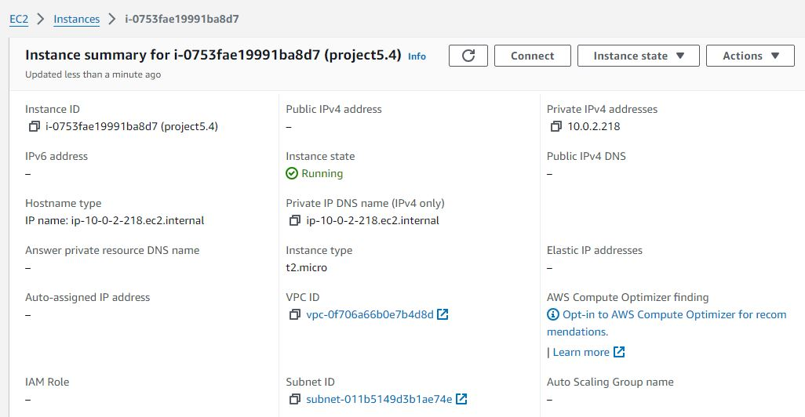

### 2.5 Create an Auto Scaling Group

Create an Auto Scaling Group that uses your launch template and spans multiple subnets.

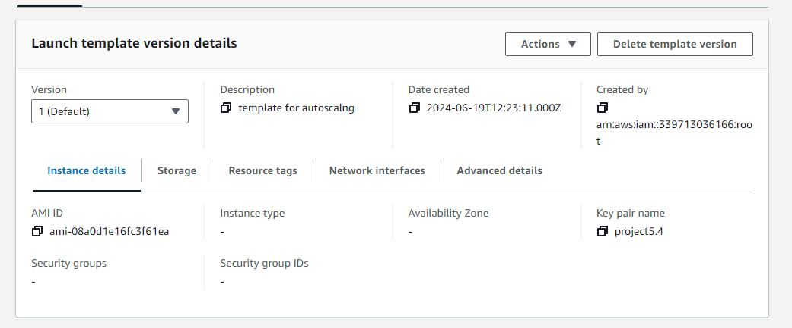

## Step 3: Deploy a Simple Node.js Application

1. Set Up a Node.js Application:

- Create a simple Node.js application.

  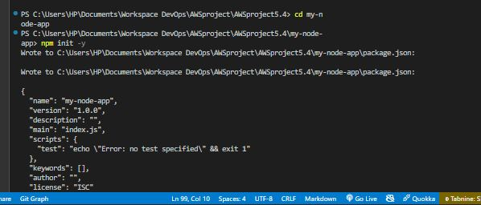

- Package the application for deployment.

  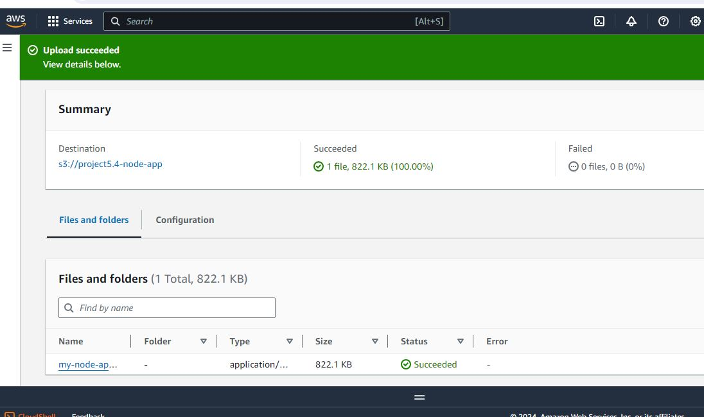

1. Deploy to EC2 Instances:

- Use the launch configuration to deploy the Node.js application to the instances.

  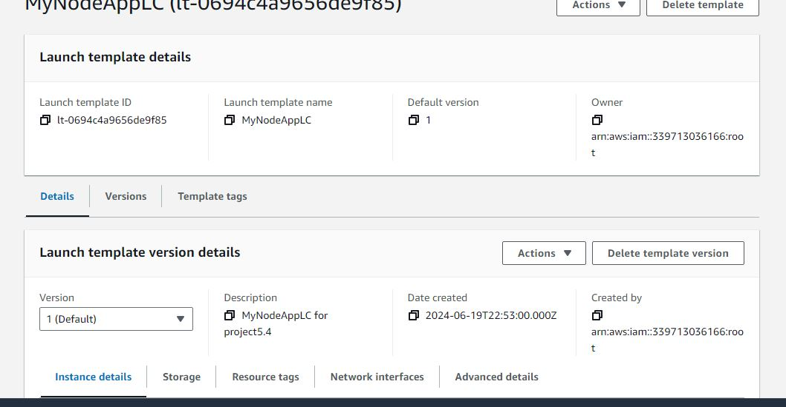

## Step 4: Load Testing

1. Perform Load Testing:

- Using Artillery to simulate traffic.

  - Install Node.js
  - Install Artillery:run the command 'npm install -g artillery'

  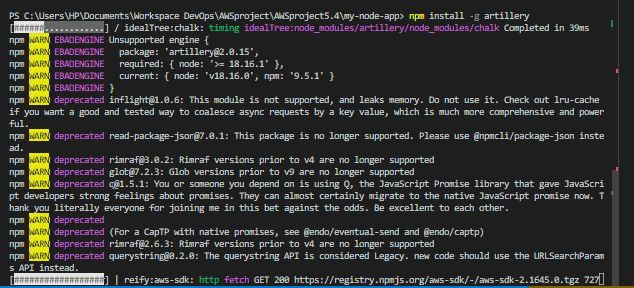

- Create a Test Script: Test.yml

  - Define your load test in this YAML file
  - Run the test by executing: 'artillery run test.yml'

- Monitor the Auto Scaling Group to ensure it scales correctly based on load.

## Step 5: Scale Up and Scale Down

- Ensure the Auto Scaling Group scales up when CPU usage rises to 80%.
- Ensure the Auto Scaling Group scales down when the load decreases.

## Step 6: Clean Up

Delete all resources to avoid unnecessary costs.

This is a test readme file
